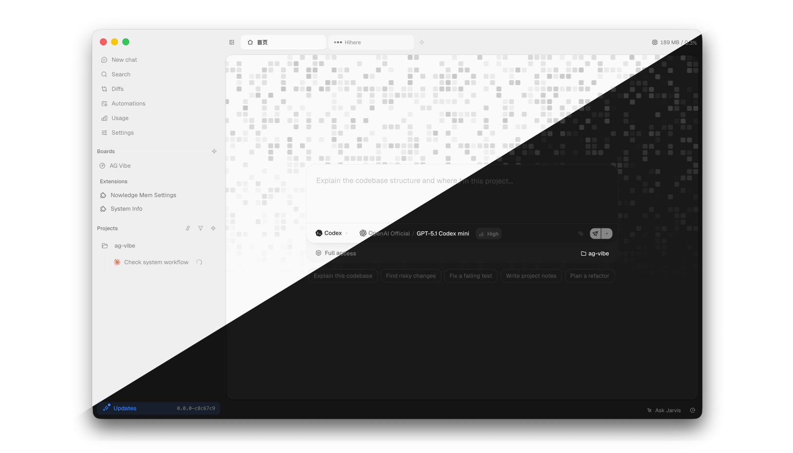
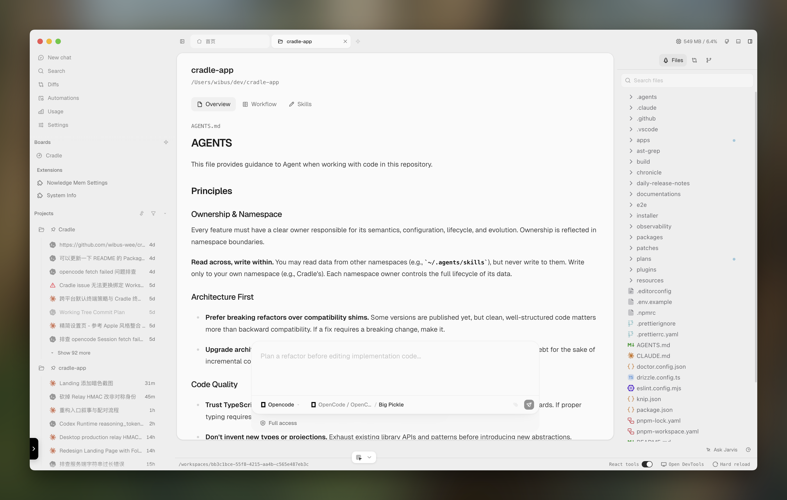
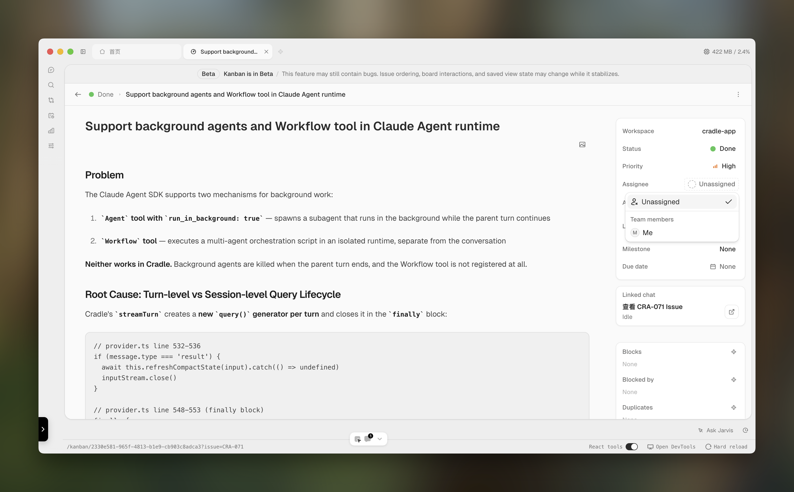
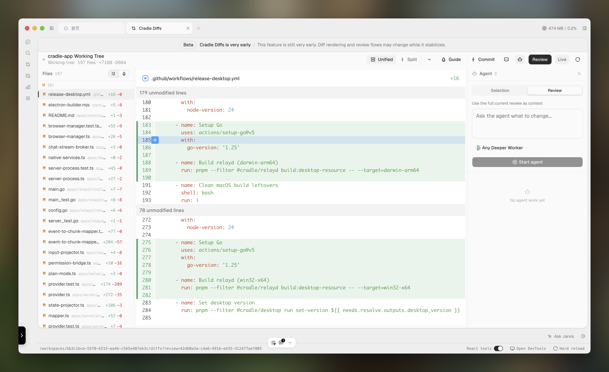
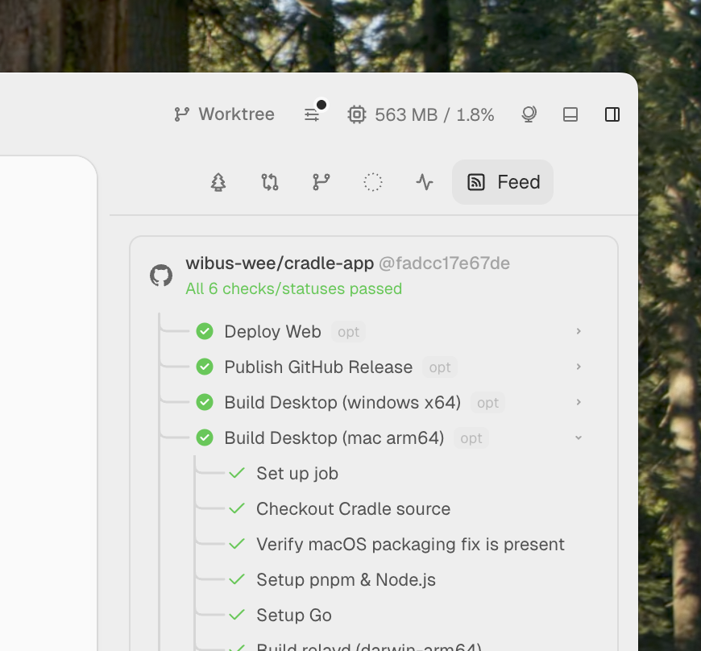
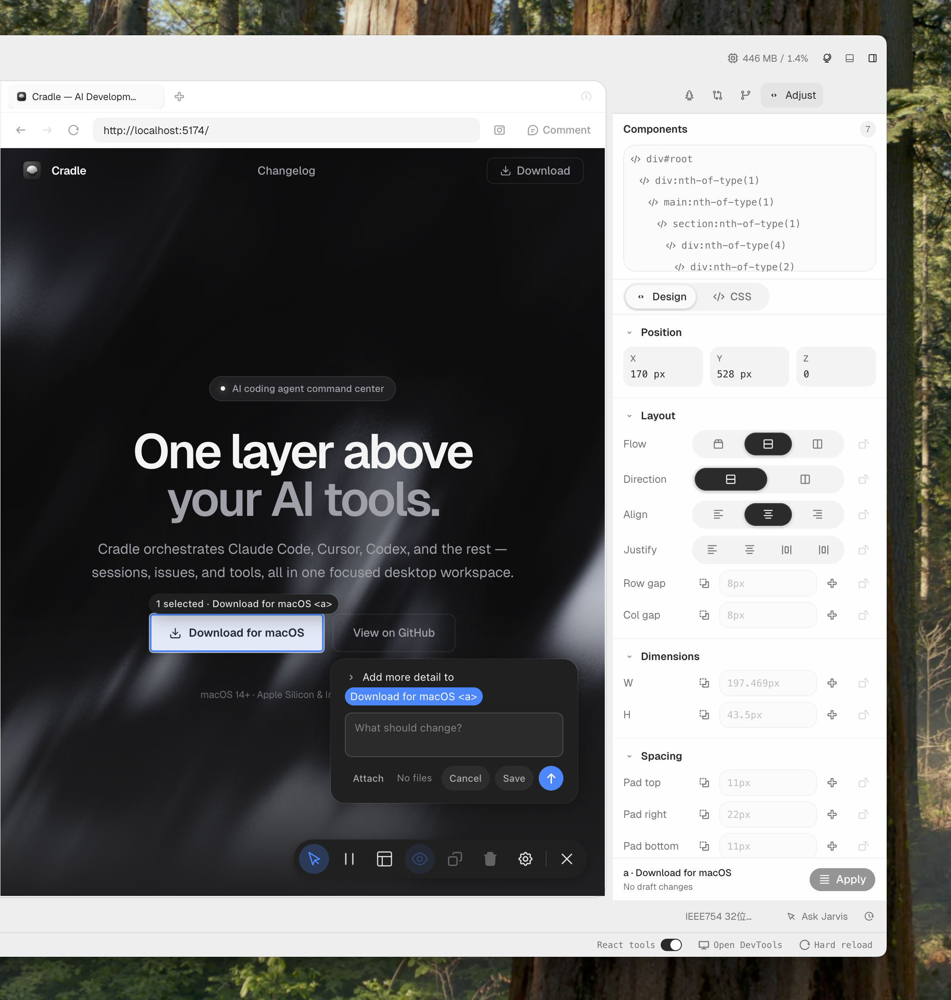
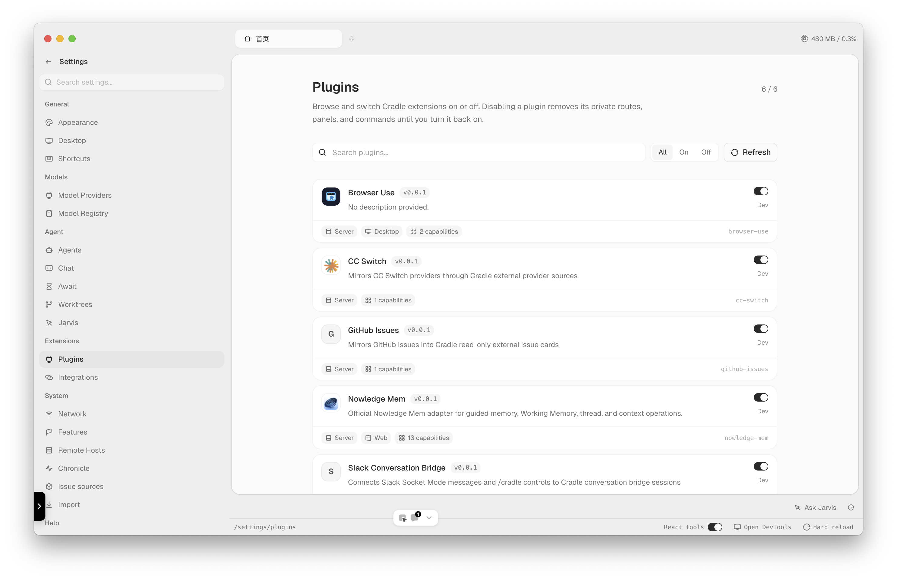
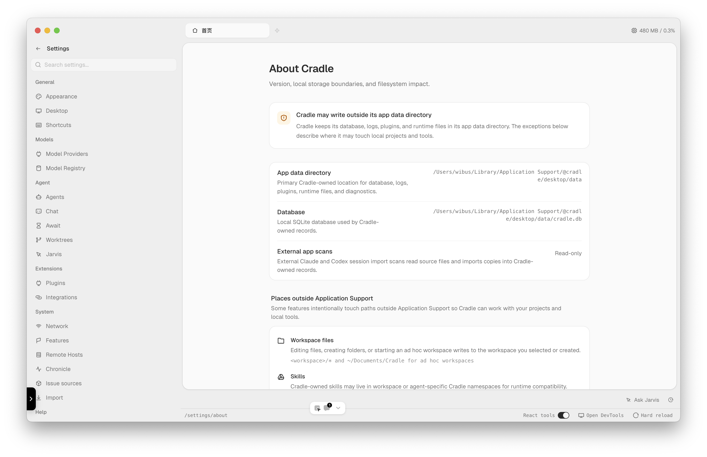

  
  <h1 align="center"><b>Cradle</b></h1>
  

    AI agent management platform — unified interface for organizing information, 
     
    managing agents, and human-AI collaboration.
     
     
    
    
     
     
    <b>Download for </b>
		<a href="https://github.com/wibus-wee/Cradle-app/releases">macOS</a> · <a href="https://github.com/wibus-wee/Cradle-app/releases">Windows</a> · Linux · <a href="https://app.cradle.wibus.ren/">Web</a>
     
  

> The project is still in the early stages of development. If you have any ideas or suggestions, please feel free to open an issue or open a pull request. Your contributions are welcome! Thank you for your support and interest in this project ❤️.

## What's Cradle?

Cradle is a desktop-first platform for managing AI agents and their workflows. It provides a unified environment where you can run agents, track issues, manage sessions, and integrate multiple LLM providers — all from a single native application.

## Features

Cradle currently spans **20 major product areas**, grouped into five workflows:

- **Agent execution** — Multi-provider chat runtimes, agent profiles, models, skills, tools, MCP, and persistent session lifecycle
- **Development workflow** — Workspaces, search and context, isolated Work containers, terminal, editor, Git, worktrees, diff review, and Pull Request delivery
- **Coordination** — Issues, Kanban, agent delegation, scheduled automation, background artifacts, session awaits, and workflow rules
- **Knowledge and operations** — Chronicle memory, local activity capture, usage and cost analytics, search, observability, and support diagnostics
- **Platform and extensions** — Plugin Marketplace, integrations, built-in Browser and Appshot, remote hosts, relay transport, downloads, and desktop updates

## Details

<table>
  <tr>
    <td>
      <h3>Workspace</h3>
      
Unified workspace for managing all your agents, sessions, and projects in one place. Navigate between contexts seamlessly with a clean, organized interface.

    </td>
    <td>
      
    </td>
  </tr>
  <tr>
    <td>
      
    </td>
    <td>
      <h3>Issue Tracking</h3>
      
Built-in Kanban board with workflow statuses, milestones, comments, and agent delegation. Track issues visually and assign tasks to AI agents.

    </td>
  </tr>
  <tr>
    <td>
      <h3>Cradle Diffs</h3>
      
Visual diff viewer for reviewing code changes made by agents. Understand what changed, why, and approve or reject modifications with confidence.

    </td>
    <td>
      
    </td>
  </tr>
  <tr>
    <td>
      
    </td>
    <td>
      <h3>Session Await</h3>
      
Persistent sessions with await support for external events like CI pipelines or human approval. Pause and resume agent workflows across time.

    </td>
  </tr>
  <tr>
    <td>
      <h3>Design Mode</h3>
      
Visual design mode for customizing the look and feel of your workspace. Tailor the interface to match your workflow preferences.

    </td>
    <td>
      
    </td>
  </tr>
  <tr>
    <td>
      
    </td>
    <td>
      <h3>Plugin System</h3>
      
Extend Cradle with official and community plugins. Build your own with the Plugin SDK to add new capabilities and integrations.

    </td>
  </tr>
  <tr>
    <td>
      <h3>Your Data, Your Control</h3>
      
Your data stays on your machine. Cradle is built with a privacy-first approach — no telemetry, no cloud dependency, full local control over your agents and conversations.

    </td>
    <td>
      
    </td>
  </tr>
</table>

## Builtin Plugins

| Plugin | Description | Status |
|---|---|---|
| `@cradleapp/browser-use` | MCP plugin that controls Cradle's built-in browser, supporting navigation, clicking, input, screenshots, page text reading, and DOM structure inspection. |  |
| `@cradleapp/system-info` | Exposes system information capabilities through the plugin API and Web commands. |  |
| `@cradleapp/github-issues` | First-party plugin that reads GitHub Issues via REST API as an external issue source, with workspace-level repository bindings and local Kanban status overlays. |  |
| `@cradleapp/slack-conversation-bridge` | Slack Socket Mode adapter and controls for the Cradle server-owned conversation bridge. |  |

### Integration Plugins

| Plugin | Description | Status |
|---|---|---|
| `@cradleapp/cc-switch` | Maps CC Switch provider data into Cradle as a read-only external provider source. |  |
| `@cradleapp/nowledge-mem` | Official Nowledge Mem adapter for guided memory, Working Memory, thread, and context operations. |  |

## Packages

| Package | Description | Status |
|---|---|---|
| [`@cradle/cli`](./packages/cli) | Generated-first TypeScript CLI for Cradle. Commands are auto-generated from the server OpenAPI spec via `pnpm gen:cli`. |  |
| [`@cradle/ipc`](./packages/ipc) [^ipc-decorator] | Type-safe IPC communication layer for Electron apps, built on top of `electron-ipc-decorator`. Provides a structured way to define IPC services with decorators, automatic type inference, and error handling. |  |
| [`@cradle/plugin-sdk`](./packages/plugin-sdk) (npm: `@cradleapp/plugin-sdk`) | SDK for building Cradle plugins — manifest types, permission system, and platform-specific entry points (server, web, desktop). |  |
| [`@cradle/streamdown`](./packages/streamdown) | Streaming markdown renderer with CPS smoothing, block-level FSM, and animated text reveal. |  |

## Feedback

Have ideas, suggestions, or feedback? Join the Telegram channel [@wibusChannel](https://t.me/wibusChannel), or open an issue on GitHub.

## 🌻 Thanks

I have been deeply inspired by the following projects and communities:

- Thanks to [Codex](https://chatgpt.com/codex/) for its feature ideas.
- Thanks to [LobeHub](https://lobehub.com/) for its streamdown implementation.
- Thanks to [Yansu](https://yansu.app/) for its chronicle ideas.
- Thanks to [Linear](https://linear.com/) for its feature ideas and design ideas.
- Thanks to [agentation](https://github.com/benjitaylor/agentation) & [Cursor](https://cursor.com/) for its visual feedback ideas
- Thanks to [CC Switch](https://ccswitch.io) for our provider management plugin integration.
- Thanks to [Nowledge Mem](https://mem.nowledge.co/) for our plugin integration.
- Thanks to [Codex++](https://github.com/BigPizzaV3/CodexPlusPlus) for our plugin integration.

## License

Cradle © Wibus. Created on Apr 25, 2026.

> [Personal Website](http://wibus.ren/) · [Blog](https://blog.wibus.ren/) · GitHub [@wibus-wee](https://github.com/wibus-wee/) · Telegram [@wibus✪](https://t.me/wibus_wee)

[^ipc-decorator]: Thanks to [Innei/electron-ipc-decorator](https://github.com/Innei/electron-ipc-decorator) for the IPC decorator inspiration and some utility code patterns.
