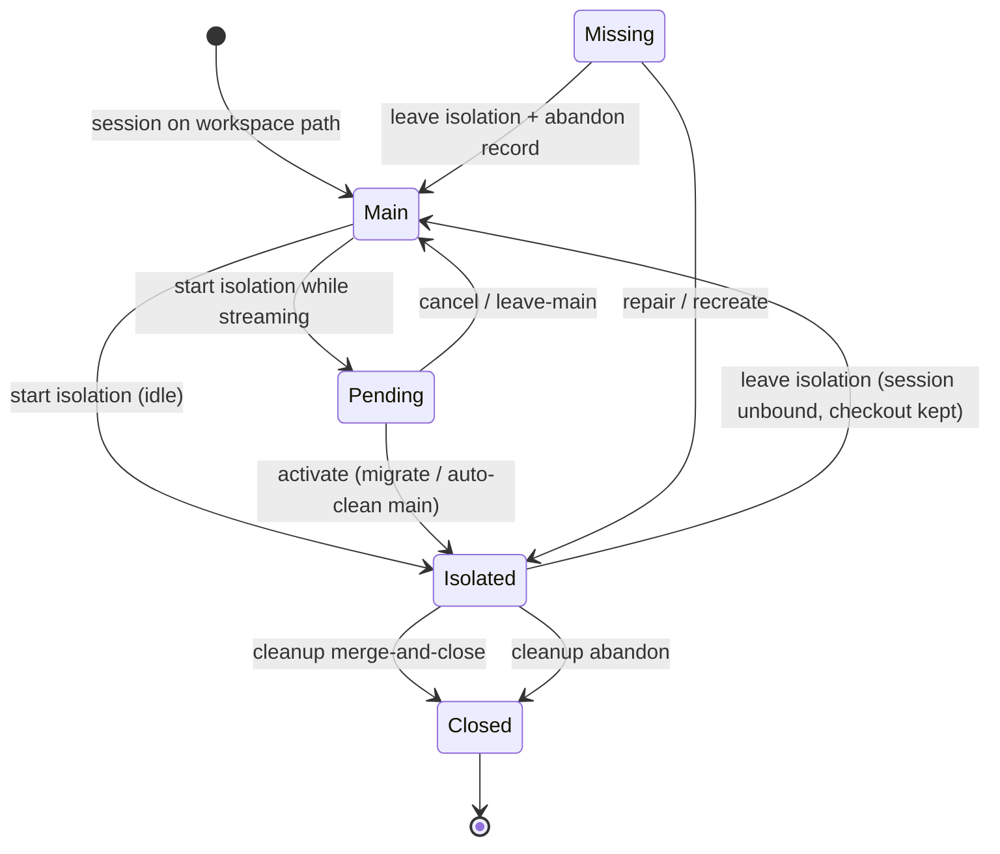

# Session Isolated Worktrees — Short Design

Aligns Cradle session isolation with Cursor’s worktree lifecycle and Cradle’s namespace rules. **Design only** — implementation follows this doc.

## Problem statement

The current implementation:

1. Stores git checkouts under `{repoRoot}/.cradle/worktrees/…`, writing Cradle-owned state into the user’s project.
2. Treats DB `worktrees.status = active` as sufficient; does not verify disk or `git worktree list`.
3. Exposes isolation through opaque UI (ref-only “arm”, icon-only header) without lifecycle clarity.

Users who delete a checkout manually get broken Agent/PTY/Git with no recovery path.

## Goals

- **Session-scoped isolation**: Agent, PTY, and git status for an isolated session run against a dedicated checkout; the linked workspace path stays the source project.
- **Cradle-owned storage**: Checkouts live under Application Support (`CRADLE_DATA_DIR`), not inside the repo.
- **Cursor-aligned lifecycle**: Explicit start → work in isolation → finish (merge/apply or abandon/delete) with visible state.
- **Reconciliation**: Detect missing/stale checkouts and surface recovery actions before execution.

## Non-goals

- Worktrees as sidebar workspaces (session remains the user-visible unit).
- Cloud / parallel multi-model runs (Cursor `/best-of-n`) — out of scope for v1.
- Changing `Session.workspaceId` when isolating (always the source project).

## Reference: Cursor model (what we align to)

| Cursor concept | Behavior |
|----------------|----------|
| Storage | Fixed app dir: `~/.cursor/worktrees` (not in project) |
| Start | `/worktree` — rest of chat runs in isolated checkout |
| Finish — apply | `/apply-worktree` — bring changes to main checkout |
| Finish — discard | `/delete-worktree` — remove isolated checkout |
| Setup | Optional `.cursor/worktrees.json` in project (install deps, copy env) |
| UX | User can tell they are in a worktree; main checkout stays untouched until apply |

Cradle maps these to session + HTTP/CLI, not slash commands, but the **lifecycle semantics** should match.

---

## Namespace & paths

### Checkout location (canonical)

```
{CRADLE_DATA_DIR}/worktrees/{sourceWorkspaceId}/{worktreeName}/
```

- `CRADLE_DATA_DIR`: same root as `cradle.db` (macOS: `~/Library/Application Support/Cradle`).
- `worktreeName`: `{sessionIdPrefix}-{slug}` (unchanged naming).
- Git branch: `cradle/wt/{worktreeName}` in the **source repo** (unchanged).

`git worktree add` targets the App Support path; the repo root remains the user’s project. Only the working tree files live in Cradle’s domain.

### Project directory (read / optional hooks only)

- **Do not** create `{repoRoot}/.cradle/worktrees/`.
- **May** read `{workspaceRoot}/.cradle/worktrees.json` for post-create setup (mirrors Cursor’s `.cursor/worktrees.json`). Cradle-owned; documents in workspace module if added later.

### Ownership table

| Data | Owner | Location |
|------|-------|----------|
| Worktree checkout files | Cradle | `CRADLE_DATA_DIR/worktrees/…` |
| Worktree metadata | Cradle | SQLite `worktrees` |
| Session binding | Cradle | `sessions.worktreeId` / `pendingWorktreeId` |
| Git objects & branches | User repo | Source project `.git` |
| User source files (main) | User | Workspace path |

---

## Domain model

### Worktree record (existing table, extended semantics)

Keep `worktrees` row; **`path` always stores the absolute App Support checkout path**.

Add **derived health** (not necessarily a DB column; computed on read):

| Health | Meaning |
|--------|---------|
| `ok` | Path exists, listed in `git worktree list` for repo root, branch matches record |
| `missing` | Path absent or not in git worktree list while DB status is `active` |
| `stale` | Git lists worktree as prunable / branch deleted; DB still `active` |

Session isolation view extends with:

```ts
type SessionIsolationView = {
  isIsolated: boolean          // true only when bound + health === 'ok'
  worktreeId: string | null
  worktreeBranch: string | null
  worktreePath: string | null  // for UI / diagnostics
  worktreeHealth: 'ok' | 'missing' | 'stale' | null
  pendingWorktreeId: string | null
  isolationBoundaryRequired: boolean
}
```

**Rule:** `isIsolated === true` only when checkout health is `ok`. If DB says isolated but health is not `ok`, expose `worktreeHealth` and block Agent/PTY until user resolves.

### Execution root

`resolveSessionExecutionRoot(session)`:

1. If no `worktreeId` → workspace path, `isIsolated: false`.
2. If `worktreeId` → run `reconcileWorktree(worktreeId)` (cheap: exists + list).
3. If health `ok` → `rootPath = worktree.path`, `isIsolated: true`.
4. If health `missing` | `stale` → **do not** silently fall back to workspace; return `isIsolated: false` with `worktreeHealth` attached and let API/UI prompt recovery. (Avoids Agent writing to wrong tree.)

---

## Lifecycle (Cursor-aligned)



### Operations

| Phase | Cradle API / UI | Cursor analogue |
|-------|-----------------|-----------------|
| **Start (new chat)** | Send ▾ → “in worktree” → create session + `POST …/isolation/start` + first message | `/worktree` at chat start |
| **Start (running chat)** | Header “隔离” → `isolation/start`; if streaming → `pending` | `/worktree` mid-chat |
| **Boundary** | Main dirty + pending → dialog: migrate / leave-main / cancel | (Cursor: manual apply) |
| **Work** | Agent, PTY, git scoped to execution root | Agent in worktree |
| **Leave** | `isolation/leave` — unbind session; checkout remains for other sessions | Keep worktree, stop using it in this chat |
| **Apply & close** | `worktrees/:id/cleanup` mode `merge-and-close` | `/apply-worktree` + `/delete-worktree` |
| **Abandon** | `cleanup` mode `abandon` | `/delete-worktree` |

### Shared worktrees

Multiple sessions may reference the same `worktreeId`. Cleanup only removes checkout when **no session** references it (existing `countSessionsUsingWorktree`).

---

## Reconciliation

### `reconcileWorktree(worktreeId)`

Run on:

- `GET /sessions/:id/isolation`
- `GET /sessions/:id` (session meta)
- Before `resolveSessionExecutionRoot` for Agent / PTY / git with `sessionId`
- Optional: workspace worktree list endpoint

Steps:

1. Load DB record; if not `active`, return health from status.
2. `existsSync(path)` — if false → `missing`.
3. `git worktree list --porcelain` from source repo root — if path not listed → `missing`.
4. If listed but branch/HEAD mismatch vs record → `stale` (or update record if safe).
5. If git reports prunable → `stale`.

### Recovery actions

| Action | API | Effect |
|--------|-----|--------|
| **Recreate** | `POST …/worktrees/:id/repair` or `isolation/repair` | If branch exists: `git worktree add` same path & branch; else new branch from `baseRef`. Update path if relocated. |
| **Leave** | `POST …/isolation/leave` | Clear `session.worktreeId`; do not delete checkout if other sessions use it. |
| **Abandon record** | `cleanup` abandon | Force-remove git registration if possible; mark DB `abandoned`; unbind all sessions. |
| **Prune sync** | Internal | `git worktree prune` then mark orphaned DB rows `abandoned`. |

UI: banner when `worktreeHealth !== 'ok'` — **“隔离环境不可用”** with Recreate / 回到主区 / 放弃并清理. Do not show generic “Git changes unavailable”.

---

## Git & PTY scoping

- Pass `sessionId` to git APIs **only when** `isIsolated && worktreeHealth === 'ok'`.
- Regenerate OpenAPI/client so `GET …/git/repositories` accepts `sessionId` (fix client `query: z.never()` bug).
- PTY cwd: `resolveSessionExecutionRoot`; fail fast with clear error if health not `ok`.

---

## UI flows (minimal)

### New chat — split-button send

Isolation is chosen **at send time** — not a navigation target, not a persistent toggle.

1. User selects project workspace → the send button becomes a split button `[Send][▾]` (a `ButtonGroup`).
2. Compose first prompt → click `Send` for a normal session, or click `▾` and pick “in worktree”.
3. “in worktree” → `postSessions` + `isolation/start` + first message, then navigate to chat.
4. Toast: “已在隔离环境 {branch} 中运行”.

No empty-session navigation. No silent ref-only arming. The choice is one-shot per send — no armed state lingers across sessions.

When the launcher is opened for an issue that already has isolation groups, a normal send still triggers `IssueIsolationStartDialog` (choose main / continue existing / new isolated); “in worktree” is an explicit new-isolated shortcut.

### Chat header — “隔离”

- Visible label or badge: `隔离` / `隔离中 · cradle/wt/…`.
- Success toast on start; boundary dialog unchanged for streaming case.

### App header chrome

- `隔离中` when `isIsolated && health ok`.
- `隔离异常` when bound but health not ok (links to recovery).

### Issue delegate

- Checkbox “在隔离环境中运行” unchanged; uses same start path.

---

## Migration from current `{repo}/.cradle/worktrees`

No legacy checkouts exist in production. New checkouts use Application Support only.

---

## Optional: `.cradle/worktrees.json`

Deferred to phase 2; shape mirrors Cursor:

```json
{
  "setup": {
    "darwin": ["npm ci"],
    "win32": ["npm ci"]
  }
}
```

Run once after `git worktree add`, cwd = new checkout. Failures → warning in isolation view, not silent.

---

## Implementation phases

| Phase | Scope |
|-------|--------|
| **A — Storage & health** | App Support paths; `reconcileWorktree`; extended `isolationView`; execution root strict mode; repair/leave APIs |
| **B — UX & git client** | Split-button “in worktree” send variant; header labels/toasts; git `sessionId` scoping + api-gen; missing-worktree banner |
| **C — Legacy & setup** | Relocate/abandon repo-path worktrees; optional `worktrees.json` hooks |

Phase A unblocks correct behavior; B fixes reported confusion; C is polish.

---

## Open questions

1. **Relocate vs recreate** for legacy repo-path checkouts: prefer `git worktree move` when path still exists?
2. **Auto-repair on session open**: recreate silently vs always prompt? **Recommendation: always prompt** (data loss risk).
3. **Merge target branch** on cleanup: default current main branch vs configurable `targetBranch` (already on cleanup API).

---

## Related files

- `service.ts` — lifecycle & execution root (to refactor)
- `../git/worktree-ops.ts` — git primitives; add `moveGitWorktree` if needed
- `../session/index.ts` — isolation routes
- Web: `use-session-isolation.ts`, `session-isolation-chrome.tsx`, `new-chat-page.tsx`, `changes-panel.tsx`
